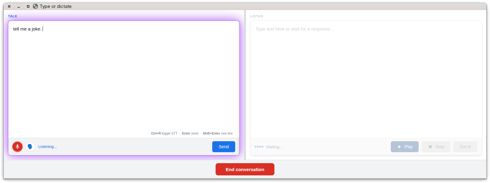
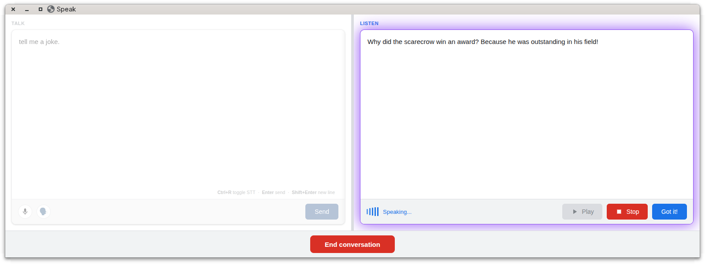
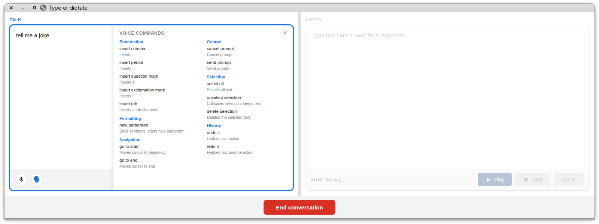

# cc-gc-stts

Talk to Claude (or Gemini CLI) and hear it talk back. Adds speech-to-text (STT) and text-to-speech (TTS) capabilities to the prompt via an MCP server, packaged as both a **Claude Code plugin** and a **Gemini CLI extension**.

## Overview

`stts` ships with:

- An **MCP server** (`stts-mcp`) exposing two tools:
  - `stt` — pops up a browser-based dictation dialog and returns the transcribed text.



- `tts` — speaks a given string aloud via a browser-based TTS window.



- A slash command **`/stts`** that runs a conversational voice loop: user speaks → model responds → response is spoken aloud → repeat until the user says nothing.
  - `commands/stts.md` — Claude Code form of the command.
  - `commands/stts.toml` — Gemini CLI form of the command.

Under the hood, the STT and TTS UIs are local HTML pages rendered in a Chrome "app window" launched through `chrome-launcher` and driven via `puppeteer-core`. Speech recognition and synthesis use the browser's Web Speech APIs.

## Project layout

```
.claude-plugin/
  plugin.json          # Claude Code plugin manifest; registers the stts-mcp stdio MCP server
  marketplace.json     # local marketplace entry for development
gemini-extension.json  # Gemini CLI extension manifest; registers the same MCP server
commands/
  stts.md              # /stts slash command for Claude Code (STT → model → TTS loop)
  stts.toml            # /stts slash command for Gemini CLI
src/
  stts-mcp-server.ts   # MCP server exposing `stt` and `tts` tools
  stts.ts              # CLI entry point dispatching on `stt` or `tts` subcommand
  chrome-launcher.ts   # HTTP client that spawns/manages the stts-daemon and sends requests
  stts-daemon.ts       # Persistent HTTP server managing a single Chrome window and request queue
  stts_ui.html         # Unified browser UI (Web Speech API for both STT and TTS)
build.mjs              # esbuild bundler; emits dist/*.mjs and copies HTML files
dist/                  # built artifacts loaded by the plugin at runtime
```

## How it works

The architecture uses a **persistent daemon** model:

1. **MCP Server** (`dist/stts-mcp-server.mjs`):
   - Registers two tools: `stt` and `tts`
   - Each tool spawns `dist/stts.mjs` (stt|tts) as a child process

2. **CLI Wrapper** (`dist/stts.mjs`):
   - Parses command-line args (title, action, text, etc.)
   - Calls `chrome-launcher.ts` functions to send HTTP requests to the daemon

3. **Persistent Daemon** (`dist/stts-daemon.mjs`):
   - Runs a long-lived HTTP server on port 15986
   - Launches a single Chrome window in app mode (`--app=http://127.0.0.1:15986/`)
   - Serves the unified `stts_ui.html` page
   - Maintains a request queue to handle concurrent stt/tts calls
   - Reuses the Chrome window across multiple requests, avoiding spawn overhead

4. **Browser UI** (`stts_ui.html`):
   - Polls the daemon via `/api/wait` for incoming requests (stt or tts mode)
   - Uses Web Speech API for both recognition and synthesis
   - POSTs results back via `/api/complete` (success) or `/api/cancel` (user cancellation)

The daemon auto-spawns if not running (via `pingDaemon()` and `spawnDaemon()`), kills itself if Chrome closes, and respects shutdown signals.

## Voice commands

Show the Voice command side panel to show all the special phases that trigger voice commands.



## Build

```bash
npm install
npm run build
```

This bundles the three entry points (`src/stts.ts`, `src/stts-mcp-server.ts`, `src/stts-daemon.ts`) into `dist/*.mjs` with esbuild and copies `stts_ui.html` alongside them.

## Usage

**Claude Code:** install the plugin via the local marketplace entry in `.claude-plugin/marketplace.json`.

**Gemini CLI:** install as an extension using `gemini-extension.json` (points at `dist/stts-mcp-server.mjs`).


## Install from git

### Claude Code

```bash
claude plugins marketplace remove stts-marketplace ; claude plugins marketplace add https://github.com/sandipchitale/cc-gc-stts.git ; claude plugin install stts ; cls ; claude
```
### Gemini CLI

```bash
gemini extensions uninstall stts ; gemini extensions install --consent https://github.com/sandipchitale/cc-gc-stts.git ; cls ; gemini
```

## Install from source

### Claude Code

```bash
cd .../cc-gc-stts-safari
claude plugins marketplace remove stts-marketplace ; claude plugins marketplace add "$PWD" ; claude plugin install stts ; cls ; claude
```

### Gemini CLI

```bash
cd .../cc-gc-stts-safari
gemini extensions uninstall stts ; gemini extensions install --consent "$PWD" ; cls ; gemini
```


In a session:

- **`/stts`** — start a voice conversation loop (user speaks → model responds → response is spoken → repeat).
- **Direct tool calls** — call the `stt` / `tts` MCP tools directly from a prompt.

The daemon spawns automatically on first use (port 15986). The Chrome window persists across multiple requests and terminates when you close it or when the daemon shuts down.

## Daemon architecture

The daemon runs as a **long-lived background process** that persists across multiple requests:

- **Port:** Fixed to `15986` to ensure the daemon reuses a single port.
- **Spawning:** Auto-spawned by `chrome-launcher.ts` if not already running (via `pingDaemon()`).
- **Chrome window:** Launched in app mode (`--app=http://127.0.0.1:15986/`) with the necessary flags (microphone auto-allow, no user gesture for autoplay, fake media stream UI).
- **Request queue:** Handles one request at a time; returns 409 (Conflict) if busy.
- **User data dir:** Chrome profile stored in `${TMPDIR}/ai-sidekick-user-data-dir` (persistent across daemon restarts).
- **Shutdown:** Daemon exits cleanly if Chrome closes or on SIGTERM/SIGINT.

To manually stop the daemon, close the Chrome window or run:
```bash
curl -X POST http://127.0.0.1:15986/api/shutdown
```

## Requirements

- Node.js 18+
- A Chrome/Chromium installation discoverable by `chrome-launcher`
- Microphone access (the daemon pre-grants microphone permission to the local file URL)

## License

MIT — Sandip Chitale
