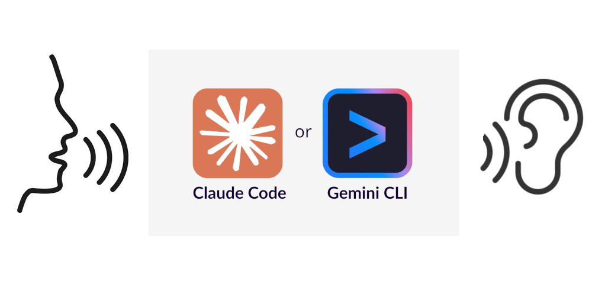
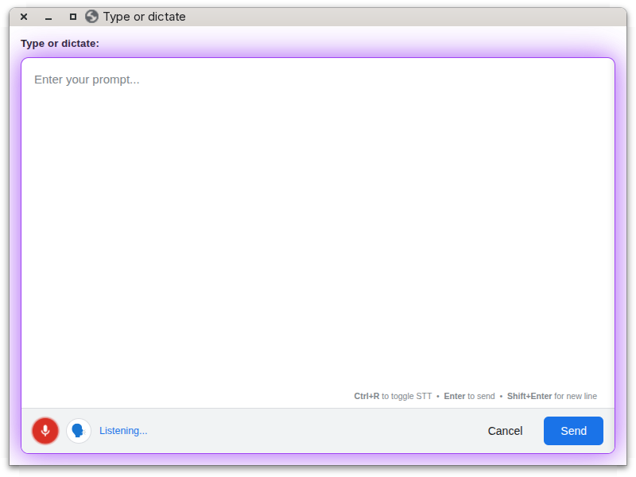
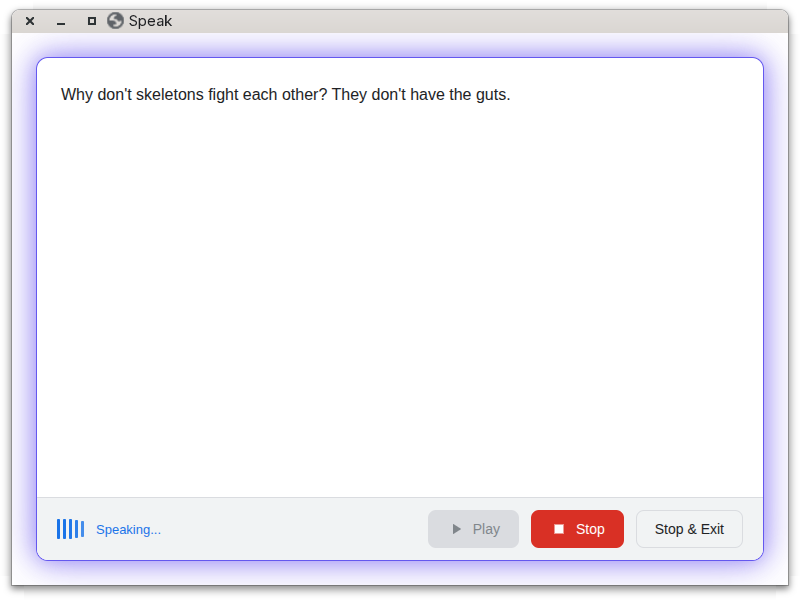

# cc-gc-stts

Talk to Claude (or Gemini CLI) and hear it talk back. Adds speech-to-text (STT) and text-to-speech (TTS) capabilities to the prompt via an MCP server, packaged as both a **Claude Code plugin** and a **Gemini CLI extension**.



## Overview

`stts` ships with:

- An **MCP server** (`stts-mcp`) exposing two tools:
  - `stt` — pops up a browser-based dictation dialog and returns the transcribed text.



- `tts` — speaks a given string aloud via a browser-based TTS window.



- A slash command **`/stts`** that runs a conversational voice loop: user speaks → model responds → response is spoken aloud → repeat until the user says nothing.
  - `commands/stts.md` — Claude Code form of the command.
  - `commands/stts.toml` — Gemini CLI form of the command.

Under the hood, the STT and TTS UIs are local HTML pages rendered in a Chrome "app window" launched through `chrome-launcher` and driven via `puppeteer-core`. Speech recognition and synthesis use the browser's Web Speech APIs.

## Project layout

```
.claude-plugin/
  plugin.json          # Claude Code plugin manifest; registers the stts-mcp stdio MCP server
  marketplace.json     # local marketplace entry for development
gemini-extension.json  # Gemini CLI extension manifest; registers the same MCP server
commands/
  stts.md              # /stts slash command for Claude Code (STT → model → TTS loop)
  stts.toml            # /stts slash command for Gemini CLI
src/
  stts-mcp-server.ts   # MCP server exposing `stt` and `tts` tools
  stt.ts               # CLI that launches the STT dialog, prints transcript to stdout
  tts.ts               # CLI that launches the TTS window and speaks input text
  stt_ui.html          # STT browser UI (Web Speech API recognition)
  tts_ui.html          # TTS browser UI (Web Speech API synthesis)
  chrome-sidekick.ts   # helpers to launch Chrome and connect via Puppeteer
build.mjs              # esbuild bundler; emits dist/*.mjs and copies HTML files
dist/                  # built artifacts loaded by the plugin at runtime
```

## How it works

- `plugin.json` starts `dist/stts-mcp-server.mjs` as a stdio MCP server.
- The server registers two tools:
  - `stt` — spawns `dist/stt.mjs` as a child process; the STT UI writes the transcribed text to stdout, which is returned to the model.
  - `tts` — spawns `dist/tts.mjs --oneshot`, piping the text to speak via stdin; the window speaks it and exits.
- The `/stts` command orchestrates a loop: call `stt`, if the result is empty print `Done.` and stop; otherwise forward the transcript to the model and pass the reply to `tts`.

## Build

```bash
npm install
npm run build
```

This bundles `src/stt.ts`, `src/tts.ts`, and `src/stts-mcp-server.ts` into `dist/*.mjs` with esbuild and copies the HTML UIs alongside them.

## Usage

**Claude Code:** install the plugin via the local marketplace entry in `.claude-plugin/marketplace.json`.

**Gemini CLI:** install as an extension using `gemini-extension.json` (points at `dist/stts-mcp-server.mjs`).

Then in a session:

- Run `/stts` to start a voice conversation loop.
- Or call the `stt` / `tts` MCP tools directly from a prompt.

## Requirements

- Node.js 18+
- A Chrome/Chromium installation discoverable by `chrome-launcher`
- Microphone access (the STT launcher pre-grants microphone permission to the local file URL)

## License

MIT — Sandip Chitale
